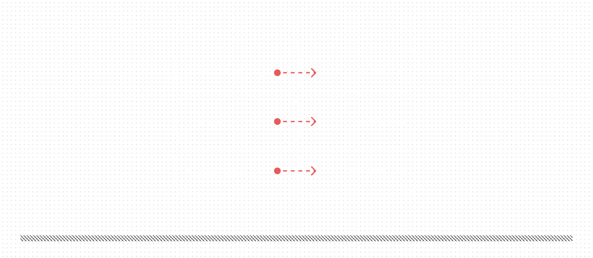
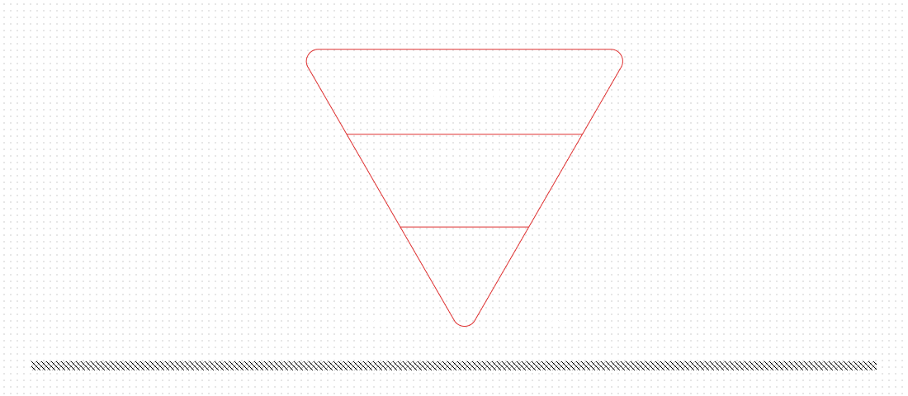
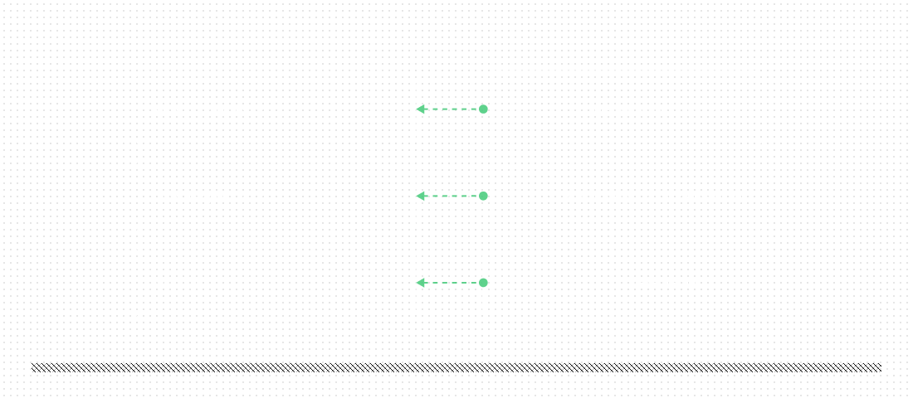
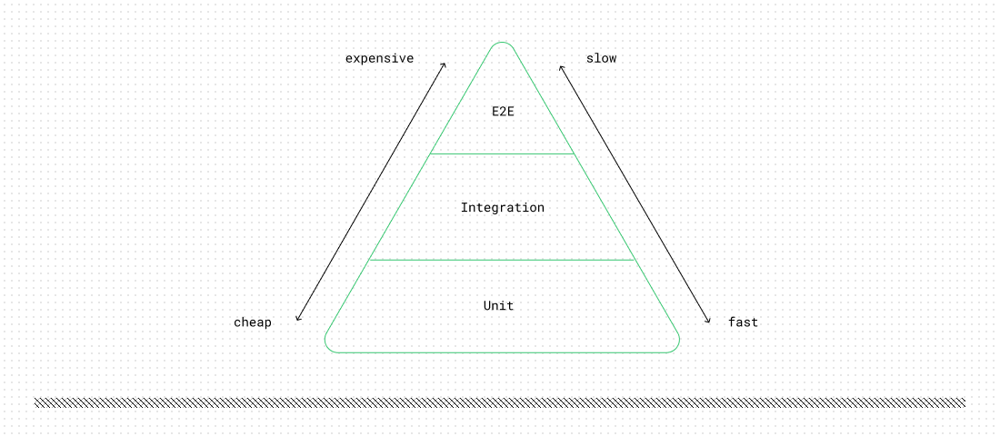
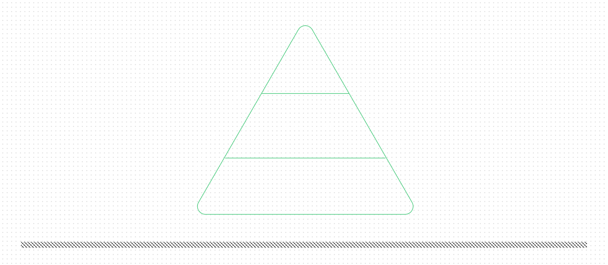
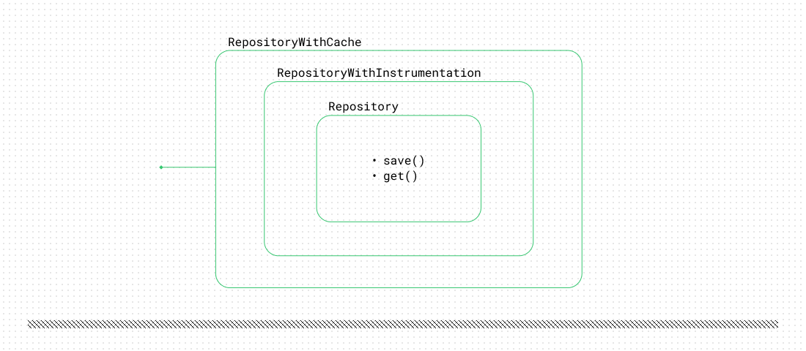
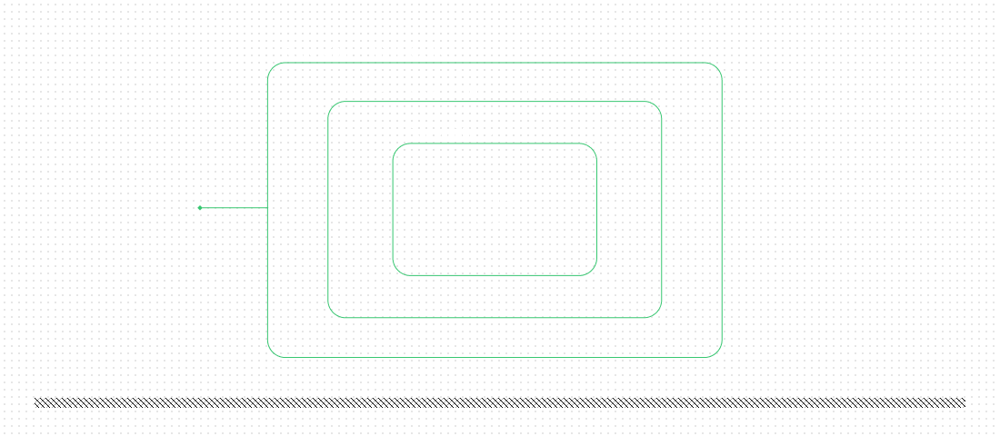

+++
title = 'Inverting Dependencies in a FastAPI Endpoint'
date = 2026-06-02T16:30:00Z
draft = false
summary = 'Let’s discuss SOLID one more time. If your work is somehow related to software development or you are interested in programming, chances are you’ve heard this famous (or infamous) acronym before. There are countless blog posts, articles, and YouTube videos about it. It’s probably one of the most discussed acronyms in the world of software. But in this post, I’d like to reflect specifically on the last (but not least) letter, D, which refers to the Dependency Inversion Principle, or DIP. Why is this principle important for writing maintainable code? Is it important at all? Why bother? To answer these questions, let’s try to invert a FastAPI endpoint.'
coverAlt = 'A person holding a black-and-white ball'
coverCaption = '[A person holding a black-and-white ball](https://unsplash.com/photos/person-holding-white-and-black-ball-S25LFoKAjDE)'
tags = ['python', 'FastAPI', 'SOLID', 'DIP']
categories = ['article']
+++
Let’s discuss SOLID one more time. If your work is somehow related to software development or you are interested in programming, chances are you’ve heard this famous (or infamous) acronym before. There are countless blog posts, articles, and YouTube videos about it. It’s probably one of the most discussed acronyms in the world of software. But in this post, I’d like to take a closer look at the last (but not least) letter, *D*, which refers to the Dependency Inversion Principle, or DIP. Why is this principle important for writing maintainable code? Is it important at all? Why bother? To answer these questions, let’s try to invert a FastAPI endpoint.

## Definition

To begin our discussion, we need to define the terms. The classic definition of the principle states:
1. *High-level modules should not depend on low-level modules. Both should depend on abstractions.*
2. *Abstractions should not depend on details. Details should depend on abstractions.*

Well, as with most other software development principles, it’s rather *abstract*. Several terms remain unclear. First, what are high-level and low-level modules? Second, why is there a second part to the definition? To answer these questions, we’ll dive into a practical problem.

## The problem

To grasp the main points of DIP, it makes sense to consider some code — after all, the principle is fundamentally about code. Let’s take a look[^1] at the following function for handling HTTP requests using the popular FastAPI framework.

```python
@app.post("/tickets", status_code=201)
async def create_ticket(
    request: CreateTicketRequest,
    db: AsyncSession = Depends(get_db),
    http_client: httpx.AsyncClient = Depends(get_http_client),
) -> CreateTicketResponse:
    llm_response = await CLIENT.chat.completions.create(
        model="gpt-5-mini",
        messages=[
            {"role": "developer", "content": LLM_INSTRUCTIONS},
            {"role": "user", "content": request.message},
        ],
    )
    is_critical = llm_response.choices[0].message.content == "CRITICAL"
    ticket = Ticket(
        id=uuid4(),
        customer_email=request.customer_email,
        message=request.message,
        is_critical=is_critical,
    )
    db.add(ticket)
    await db.commit()
    if is_critical:
        await http_client.post(
            f"https://api.telegram.org/bot{BOT_TOKEN}/sendMessage",
            json={"chat_id": MANAGER_ID, "text": ticket.message},
        )
    return CreateTicketResponse(id=ticket.id)
```

In this example, we are developing a fictional application for managing support requests from our users. Here, we have an HTTP handler for processing support tickets. First, we determine whether a ticket is critical. After that, we save it to the database. Finally, if it’s critical, we send a Telegram notification to the manager.

What can we say about this code? Is it bad? Well, it solves the problem; it does what it’s supposed to do. If all we have to do is implement this API endpoint and never touch it again, this code is probably fine. The problem becomes clearer when we consider the long term and team collaboration. What if we have to maintain this code for an indefinite period of time? What if we are working on the application with a few colleagues who have to read and maintain this code daily? In such a scenario, some factors become crucial to the application’s success.

### Coupling

So where are the high-level modules from the definition in this example? We can think of high-level modules as the code that represents the main purpose of our application — *the business logic*. Why does this API handler even exist? What problem does it solve? Looking at the handler for the first time, the answers to these questions are not straightforward. We have to dig into many unrelated technical details. The business logic — the main purpose of our application — is contaminated with many low-level concerns, such as making HTTP requests and querying the database.

If we look at the code more closely, we’ll start to realize there are three main high-level concerns: determining a ticket’s priority, persisting it to storage, and sending notifications if intervention is needed. However, in the current implementation, our high-level modules depend heavily on low-level modules for networking and database access. This obviously violates the principle.

<figure class="mx-auto my-0 rounded-md">
    
    
    <figcaption class="text-center">
        Business logic is coupled to low-level details
    </figcaption>
</figure>

Any possible changes to the low-level code also affect the business logic. What if we have to switch to another LLM provider? Or send email notifications? In all such cases, we have to update the high-level module’s code. Low-level details are tightly coupled to the business-level code.

Suppose it’s not just one demo handler, but hundreds of API endpoints our imaginary team has to support. In this scenario, the issue becomes much worse. *Tight coupling is what kills software in the long term.* If coupling is not managed properly, your application will likely become an unmaintainable “Big Ball of Mud.”

### Testability

Since we strive to be responsible software engineers, we should write some tests for the handler. Let’s consider our options for testing. Unfortunately, it’s rather difficult to test such tightly coupled code. There are dependencies on global variables, such as `CLIENT`, and objects from third-party libraries, such as `db`. It makes testing hard and onerous. Fortunately, we’re developing in Python and can leverage all its magic (🪄 everyone likes magic, right?). We could write something with mocks and monkey patches:

```python
# test_api.py
# Arrange
monkeypatch.setattr(
    api,
    "CLIENT",
    SimpleNamespace(
        chat=SimpleNamespace(
            completions=SimpleNamespace(
                create=AsyncMock(return_value=_llm_response("NORMAL"))
            )
        )
    ),
)
db = Mock()
db.commit = AsyncMock()
http_client = Mock()
http_client.post = AsyncMock()
```

And test the handler using all this machinery:
```python
# test_api.py
# Act
request = api.CreateTicketRequest(
    customer_email="customer@example.com",
    message="The export button is slightly misaligned.",
)
response = asyncio.run(
    api.create_ticket(request=request, db=db, http_client=http_client)
)
# Assert
db.add.assert_called_once()
db.commit.assert_awaited_once()
http_client.post.assert_awaited_once_with(...)
```

So, why not just use `unittest.mock` for everything and save time and effort? The problem is that such tests are very brittle and hard to maintain. So many mocks — imagine our business logic changes one day, but these tests might remain joyfully green. What are we even testing here? Are we testing the business logic or how the mocks work?

If using mocks and monkey patches becomes necessary to test a piece of code, *it is often a sign of deeper structural problems and tight coupling.* We can’t isolate a piece of code for testing, so we fall back on mocks. It feels like a hack. Furthermore, the general understanding in the Python world is that magical mocking and monkey patching are considered code smells. This feeling is perfectly summarized by the phrase “[Monkey patching is software bankruptcy](https://svcs.hynek.me/en/stable/why.html#why)”.

Another testing strategy we have is to rely entirely on integration and end-to-end tests. We could run the database in a separate Docker container, and each test could query the real database, right? We could even set up a dedicated HTTP server to handle test requests. This would technically work, but let’s imagine, for a moment, that we have hundreds of tests written this way. Each one requires access to the DB, meaning time is spent setting up and tearing down the database before and after every test. Not only is this approach onerous to set up and manage, but such a test suite would take a very long time to run, hampering our morale and productivity. Additionally, if we refer to industry-established wisdom, we’ll see that our testing pyramid is upside down — probably a bad sign.

<figure class="mx-auto my-0 rounded-md">
    
    
    <figcaption class="text-center">
        The testing pyramid is upside down
    </figcaption>
</figure>

### Change

The real world is constantly changing — new technologies emerge, new frameworks and libraries become trendy, and our product manager suddenly has a brilliant new idea. As the famous proverb puts it, “*Change is the only constant,*” so we and our code have to be ready.

Let’s consider how easy it would be to swap dependencies or add new behavior to the current implementation of the handler. For instance, switching from the OpenAI SDK to the Anthropic SDK would require us — as we discussed in the coupling section — to touch a module containing the business logic. We have to very carefully remove old coupled code and replace it with new code, almost like surgeons.

Or what if we need to instrument database queries to analyze their performance? In the current design, it could look something like this:
```python
# async def create_ticket(...):
start = perf_counter()
ticket = Ticket(
    id=uuid4(),
    customer_email=request.customer_email,
    message=request.message,
    is_critical=is_critical,
)
db.add(ticket)
await db.commit()
end = perf_counter()
print("Total time:", end - start)
# ...
```
Each time we implement such low-level changes in a high-level module, the chance of introducing a new bug into the business logic becomes slightly higher. Each subsequent change of this kind is harder to implement than the previous one. The business logic becomes increasingly convoluted with unrelated low-level details and grows more and more difficult to maintain.

### Code clarity

In fact, the obscurity of the business logic in the example is an important factor by itself. Mixing different levels of abstraction within a single code unit makes it difficult to read (and, of course, there is [a dedicated software principle](https://principles-wiki.net/principles:single_level_of_abstraction) to support this point). While reading such code, we have to process all those technicalities about HTTP requests, performance measurements, and database queries. We have to mentally jump between high-level and low-level concerns, which creates unnecessary cognitive load.

As we’ve seen so far, the current implementation significantly hampers the application’s readability and understandability. And *the harder it is to read a piece of code, the harder it is to maintain.*

## DIP

So, how can DIP help with all these issues? According to the principle, *low-level details should depend on high-level modules*, not the reverse. The business logic shouldn’t depend on any low-level concern, which is not the case in the current design. We need *to invert the dependency direction* somehow. To do that, let’s try to isolate the business logic by introducing abstractions relevant to the original problem:

```python
# core.py
class PriorityDetector(Protocol):
    async def detect(self, text: str) -> Priority: ...

class TicketRepository(Protocol):
    async def save(self, ticket: Ticket) -> None: ...

class Notifier(Protocol):
    async def notify(self, ticket: Ticket) -> None: ...

async def submit_ticket(
    customer_email: str,
    message: str,
    ticket_repository: TicketRepository,
    priority_detector: PriorityDetector,
    notifier: Notifier,
) -> Ticket:
    priority = await priority_detector.detect(message)
    ticket = Ticket(
        customer_email=customer_email,
        message=message,
        priority=priority,
    )
    await ticket_repository.save(ticket)
    if ticket.is_critical:
        await notifier.notify(ticket)
    return ticket
```

Here, `core.py` is our high-level module, where we define the business logic in terms of abstractions. There is no OpenAI SDK, no HTTP requests, and no DB queries. This `submit_ticket` function represents the business logic, and it doesn’t depend on any infrastructure concerns. It operates on simple Python classes and depends on abstractions, as the principle’s first rule requires.

According to the principle, low-level modules must also depend on abstractions. Therefore, we can create a new module with concrete classes that implement the protocols defined in the high-level module. For instance, a ticket priority detector can be implemented using the OpenAI SDK:
```python
class OpenAiPriorityDetector(PriorityDetector):
    def __init__(self, api_key: str) -> None:
        self._client = AsyncOpenAI(api_key=api_key)

    async def detect(self, text: str) -> Priority:
        llm_instructions = (
            "Analyze the priority of the following support ticket. "
            "Respond with 'CRITICAL' or 'NORMAL'."
        )
        llm_response = await self._client.chat.completions.create(
            model="gpt-5-mini",
            messages=[
                {"role": "developer", "content": llm_instructions},
                {"role": "user", "content": text},
            ],
        )
        return (
            Priority.CRITICAL
            if llm_response.choices[0].message.content == "CRITICAL"
            else Priority.NORMAL
        )
```

`TicketRepository` and `Notifier`[^2] can be implemented similarly, using any technologies and libraries we want. The dependency direction is now reversed.

<figure class="mx-auto my-0 rounded-md">
    
    
    <figcaption class="text-center">
        Dependency inversion
    </figcaption>
</figure>

Notice that the high-level module (`core.py`) "owns" the abstractions. They are defined strictly according to the original business domain rather than technical concerns. There is neither an `OpenAiClient` protocol nor a `TelegramClient` abstraction. *The details depend on the abstractions*, as the principle’s second rule requires.

### Coupling

We have, in effect, uncoupled the business logic from low-level details. This makes it much easier to change both aspects independently. If a new product requirement arrives — say, we have to send notifications for all types of tickets, not only critical ones — the changes can be implemented locally in the `submit_ticket` function. All other parts of the application are untouched. Similarly, it’s possible to replace the OpenAI SDK with the Anthropic SDK just by implementing the `PriorityDetector` protocol. Such a change would not affect the business logic in any way.

### Testability

Since the business logic is completely isolated, we can write as many unit tests as we need. All corner cases and rare conditions can be tested in isolation from heavy infrastructure dependencies. These tests wouldn’t require us to set up and tear down a database or an HTTP server. Besides, running such tests would be pretty fast.

The `submit_ticket` function clearly defines all its dependencies in the signature. This means the only remaining step for testing is to implement a few helper classes, commonly known as *test doubles*.

```python
# conftest.py
class FakePriorityDetector(PriorityDetector):
    CRITICAL_MESSAGE = "critical"

    async def detect(self, text: str) -> Priority:
        return (
            Priority.CRITICAL 
            if text == self.CRITICAL_MESSAGE 
            else Priority.NORMAL
        )

class FakeTicketRepository(TicketRepository):
   # ...

class FakeNotifier(Notifier):
   # ...
```

After that, a unit test can be written using these test doubles:
```python
# test_core.py
async def test_submit_ticket_notifies_for_critical_ticket(
    ticket_repository: FakeTicketRepository,
    priority_detector: FakePriorityDetector,
    notifier: FakeNotifier,
) -> None:
    # Act
    ticket = await submit_ticket(
        customer_email="customer@example.com",
        message=FakePriorityDetector.CRITICAL_MESSAGE,
        ticket_repository=ticket_repository,
        priority_detector=priority_detector,
        notifier=notifier,
    )
    # Assert
    assert await ticket_repository.get(ticket.id) == ticket
    assert ticket.priority is Priority.CRITICAL
    notifier.assert_notification_sent()
```

On the other hand, integration tests can be written for each concrete implementation of a dependency. For example, if we wanted to test the interaction with a real database, we could write several integration tests for `PostgresTicketRepository` (or whatever database we use) to verify that the queries are correct. We don’t have to run every small test against the real database, only the specific parts of the suite that require it. *The majority of the application can be tested in isolation through unit tests.* The testing pyramid is now more stable, supported by a wide foundation.

<figure class="mx-auto my-0 rounded-md">
    
    
    <figcaption class="text-center">
        The healthy testing pyramid
    </figcaption>
</figure>

### Change

Thanks to low coupling, adding new behavior or changing existing functionality is easier now. Swapping one protocol implementation for another — like the previously mentioned move to the Anthropic SDK — is almost trivial. Simply write a new class, and it’s done.

Consider the case of instrumenting database queries. Fortunately, we don’t have to touch the high-level code at all. Instead, we can simply write a new implementation of the protocol using *the decorator pattern*:

```python
class TicketRepositoryWithInstrumentation(TicketRepository):
    def __init__(self, inner: TicketRepository) -> None:
        self._inner = inner

    async def save(self, ticket: Ticket) -> None:
        start = perf_counter()
        await self._inner.save(ticket)
        end = perf_counter()
        print("Total time:", end - start)
```

An object of this class can simply be passed to the high-level `submit_ticket` function as an argument. Interestingly, from the business logic’s point of view, nothing changes — it still accepts an implementation of the `TicketRepository` protocol. Yet we’ve added new functionality to the application. Imagine we need to add a cache for the database layer; we can repeat the trick with the decorator again.

<figure class="mx-auto my-0 rounded-md">
    
    
    <figcaption class="text-center">
        Using the decorator pattern to add new behavior
    </figcaption>
</figure>

This is also a demonstration of the *Open-Closed Principle* in action, as we can add new behavior without modifying existing classes and modules.

### Code clarity
After introducing DIP, the problem of mixed abstraction levels becomes much less severe. Modules are better separated from each other. The business logic — the `core.py` module — contains only high-level code. A reader doesn’t have to navigate a maze of technical nuances. The whole application now follows one simple but strict rule: *the rule of dependency direction*. All these factors reduce the mental burden of reading and understanding the code.

## Conclusion
Of course, this example is *drastically exaggerated for demonstration purposes*. In the real world, the difference between the two implementations would not be so obvious. But all these factors still play a role, affecting maintainability, extensibility, and other desirable characteristics of good software.

Everything has its cost. In the case of DIP, it’s more indirection, more files to manage, and more ceremony. If you are building an application alone, without the responsibility of supporting it in the future, these software principles and abstractions might be irrelevant. Just use whatever approach works for you.

But adding a team of software developers and an indefinite support period for such an application changes the equation. We should manage coupling in this case. We should carefully consider abstractions and nurture the business logic. Otherwise, the “Big Ball of Mud” is always ready to start rolling.

## Worth reading
1. The [On Coupling and Abstractions](https://www.cosmicpython.com/book/chapter_03_abstractions.html) chapter from the great book *Architecture Patterns with Python*.
2. [Layers, Onions, Ports, Adapters: it's all the same](https://blog.ploeh.dk/2013/12/03/layers-onions-ports-adapters-its-all-the-same/)
3. [DIP in the Wild](https://martinfowler.com/articles/dipInTheWild.html)
4. [Increasing Cohesion in Go with Generic Decorators](https://threedots.tech/post/increasing-cohesion-in-go-with-generic-decorators/)

[^1]: The [full version of the code](https://github.com/stkrizh/stanislavtech-examples/tree/main/examples/2026-04-dip) is available on GitHub.
[^2]: In a real application, you should consider using [the Outbox pattern](https://brandur.org/job-drain) for notifications.
